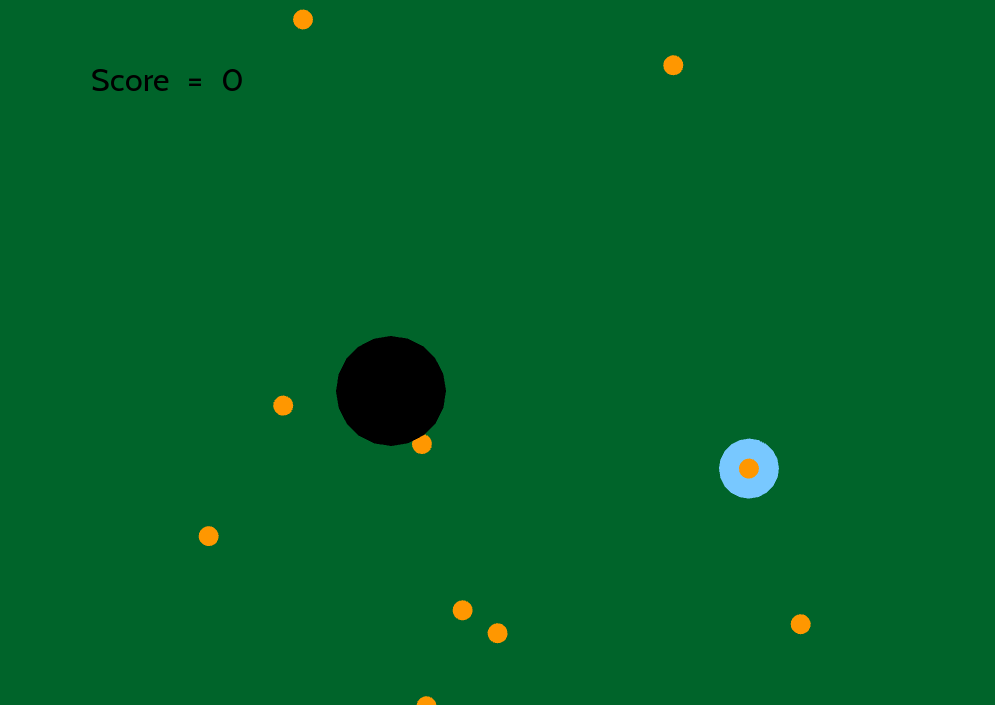

# openFrameworks Game Experiment

By [Leandra Tejedor](https://github.com/ltejedor).

## Description

Written in C++ using the openFrameoworks Toolkit.
You play as the blue dot, trying to collect all of the balls and putting them into the goal-dot for maximum score-age.

## Installation

Add to the folder myApps under apps in the openFrameworks documentation. Then run, and play.

## Usage

Use arrow keys to make the dot move.

## Information

### Known Issues

If you discover any bugs, feel free to create an issue on GitHub fork and
send me a pull request.

## Authors

* Leandra Tejedor (https://github.com/ltejedor)

## License

http://ltej.mit-license.org/
